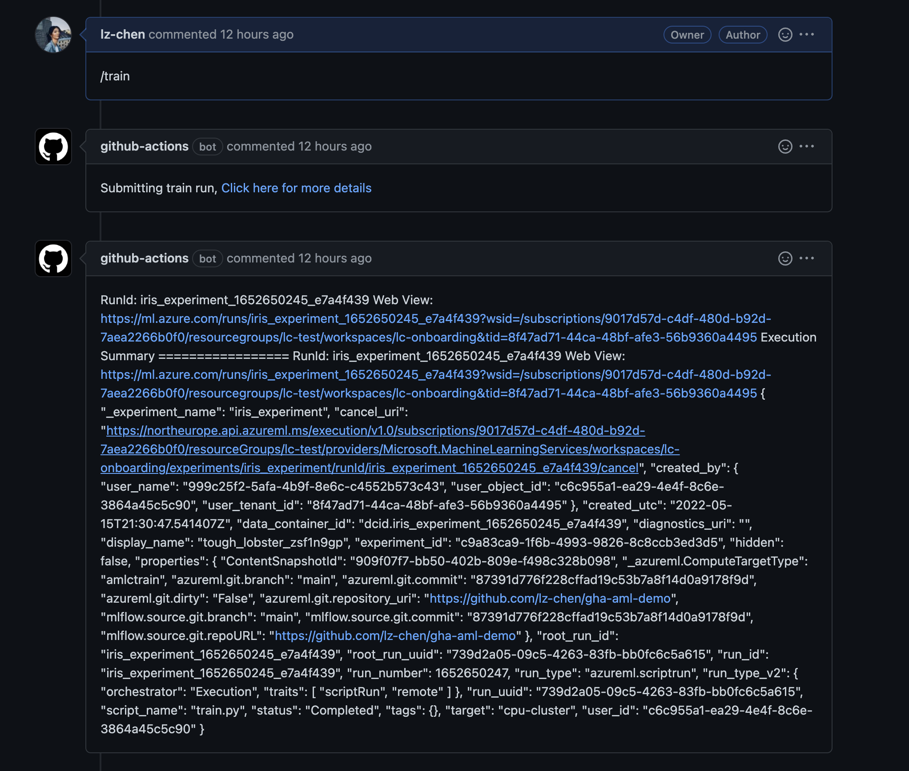
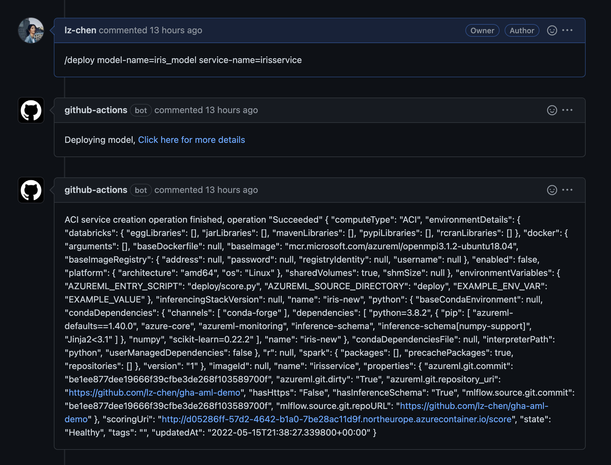

Example on how to use Github Actions to set up a CI/CD pipeline for
automating the development of a machine learning model on Azure ML.
When you open a PR and make commits, a CI job is run to check code style
and run unittests.
You can start training model and deploy model directly from the PR comments.
When the PR is merge to master, CD job is triggered to kick of re-training 
and deploying model in the Staging environment. When the deployment to 
Staging environment is finished, approval request will be promoted to reviewers.
If approved, deploying to Production environment will start.

## Prerequisite
### Repository secrets
- You need to have an Azure service principle set up, and credentials stored as secret
in the repo to run the Azure CLI commands with GHA. 
Follow steps described [here](https://github.com/Azure/aml-template#3-setting-up-the-required-secrets) to 
to create a repo secret named `AZURE_LOGIN`
- `AZURE_RESOURCE_GROUP`: your azure resource group name
- `AZURE_WORKSPACE`: your azure workspace name
- `REPO_ACCESS_TOKEN`: personal access token to github

## Example usage

Open a PR and comment following to submit training script:

```
/train param-file=dev_params.json
```
It will trigger a workflow to submit training script to AML. While it's running
the github actions bot is going post the following comments back on PR:


Comment following to deploy trained model:
```
/deploy model-name=iris_model model-version=26 service-name=irisservice
```
If you don't specify `model-version`, it will deploy the latest version of the model.
The deploy workflow will get trigger



See full example [here](https://github.com/lz-chen/gha-aml-demo/pull/6)